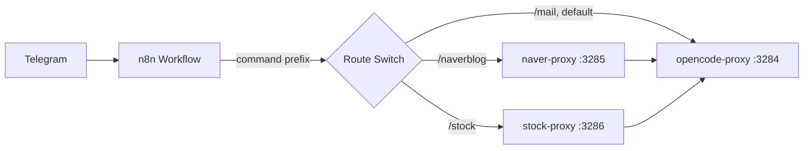
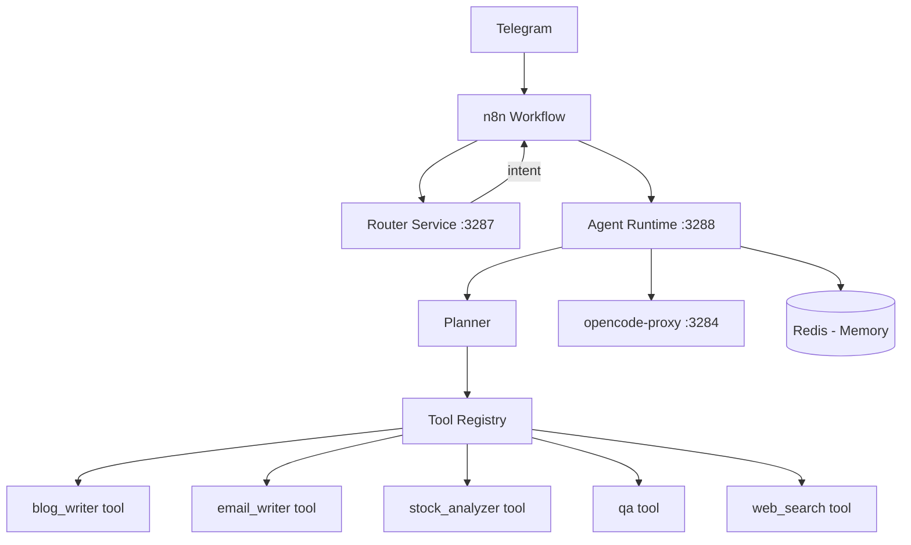
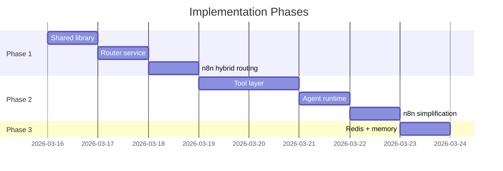

# Agent Architecture Improvement Plan

Evolve **conana-bot** from a command-routed workflow bot into a scalable agent-based platform, based on [conana-bot-updated-agent-task-plan.md](file:///Users/conana/conana-bot/conana-bot-updated-agent-task-plan.md).

## Current State Summary



**Pain points identified in the current codebase:**
- Routing is purely command-prefix based (`/stock`, `/naverblog`, `/mail`) — no natural-language understanding
- `readBody()` and `httpRequest()` are copy-pasted across all 3 proxy services
- Session storage is in-memory (`Map`) — lost on restart
- `opencode-proxy.js` is a 328-line monolith mixing session, email, media, and execution concerns
- Adding a new capability requires editing n8n JSON + creating a new Docker service
- No error recovery or retry for long-running tasks

---

## Target Architecture



---

## User Review Required

> [!IMPORTANT]
> This plan introduces **3 new services** (router, agent, shared lib) and significantly refactors the n8n workflow. I recommend implementing this in **3 incremental phases** so the system remains functional after each phase. Each phase is independently deployable.

> [!WARNING]
> Phase 2 (Agent Runtime) will **deprecate direct calls** from n8n to `naver-proxy` and `stock-proxy`. These services get absorbed into the agent's tool layer. The individual proxy services can be removed after Phase 3 is complete.

---

## Proposed Changes

### Phase 1 — Router Service + Shared Library *(Immediate)*

Creates an LLM-powered intent router and extracts shared utilities.

---

#### [NEW] [shared/](file:///Users/conana/conana-bot/shared/)

A shared npm package used by all services to eliminate code duplication.

| File | Purpose |
|------|---------|
| `shared/http-utils.js` | `readBody()`, `httpRequest()`, `respond()` |
| `shared/package.json` | Package manifest |

Existing services (`opencode-proxy.js`, `naver-proxy.js`, `stock-proxy.js`) will import from `shared/` instead of defining their own copies.

---

#### [NEW] [router/](file:///Users/conana/conana-bot/router/)

| File | Purpose |
|------|---------|
| `router/router-service.js` | HTTP server with `POST /router/intent` endpoint |
| `router/intent-classifier.js` | Calls Gemini Flash via OpenCode to classify user intent |
| `router/Dockerfile` | Docker build |
| `router/package.json` | Dependencies |

**`POST /router/intent`** API:
```json
// Request
{ "message": "write a blog post about ai agents" }

// Response
{ "intent": "blog", "confidence": 0.95 }
```

**Supported intents:** `blog`, `email`, `qa`, `stock`, `automation`, `general`

The classifier will use a structured prompt to Gemini Flash (via the OpenCode `/run` endpoint) to return JSON intent classification. Commands starting with `/` bypass the router entirely (handled in n8n).

---

#### [MODIFY] [docker-compose.yml](file:///Users/conana/conana-bot/docker-compose.yml)

Add `router` service on port 3287, with `OPENCODE_URL` pointing to opencode-proxy.

---

#### [MODIFY] [n8n-workflow-docker.json](file:///Users/conana/conana-bot/n8n-workflow-docker.json)

Update the "Route by Command" node to implement **hybrid routing**:
1. If message starts with `/` → use existing command logic (deterministic)
2. Else → call `POST http://router:3287/router/intent` → route by returned intent

Update the "Route Switch" to handle the new intent values (`blog`, `email`, `stock`, `qa`, `general`).

---

### Phase 2 — Agent Runtime + Tool Layer *(Next)*

Creates a centralized agent service with a planner and tool registry.

---

#### [NEW] [agent/](file:///Users/conana/conana-bot/agent/)

| File | Purpose |
|------|---------|
| `agent/agent-service.js` | HTTP server with `POST /agent/run` |
| `agent/planner.js` | Selects tools based on intent, constructs execution plan |
| `agent/executor.js` | Executes planned steps sequentially |
| `agent/tools/registry.js` | Tool registry — discovers and loads tools |
| `agent/tools/blog-writer.js` | Blog writing tool (absorbs naver-proxy logic) |
| `agent/tools/email-writer.js` | Email drafting tool (absorbs opencode-proxy email logic) |
| `agent/tools/qa.js` | General Q&A tool (wraps opencode `/run`) |
| `agent/tools/stock-analyzer.js` | Stock analysis tool (absorbs stock-proxy logic) |
| `agent/tools/web-search.js` | Placeholder — web search (future) |
| `agent/Dockerfile` | Docker build |
| `agent/package.json` | Dependencies |

**`POST /agent/run`** API:
```json
// Request
{ "intent": "blog", "input": "AI agent architecture", "chatId": "123", "sessionId": "abc" }

// Response
{ "chatId": "123", "formattedText": "...", "sessionId": "abc" }
```

**Tool interface** — each tool exports:
```js
module.exports = {
  name: "blog_writer",
  description: "Writes a blog article on a given topic",
  inputSchema: { topic: "string" },
  execute: async ({ topic, chatId, sessionId }) => { /* ... */ }
};
```

---

#### [MODIFY] [docker-compose.yml](file:///Users/conana/conana-bot/docker-compose.yml)

Add `agent` service on port 3288, depending on `opencode-proxy`.

---

#### [MODIFY] [n8n-workflow-docker.json](file:///Users/conana/conana-bot/n8n-workflow-docker.json)

Simplify the workflow: for non-command messages, after the router returns an intent, call `POST http://agent:3288/agent/run` instead of individual proxy services. The n8n workflow becomes:

```
Telegram → Parse → Session → Route by Command
  ├── /new → session reset flow  (unchanged)
  ├── /stock, /naverblog, /mail → Agent API (with explicit intent override)
  └── natural text → Router API → Agent API
Agent API → Send Reply
```

---

### Phase 3 — Memory Layer *(Later)*

Adds persistent conversation context using Redis.

---

#### [MODIFY] [docker-compose.yml](file:///Users/conana/conana-bot/docker-compose.yml)

Add `redis` service.

---

#### [NEW] [shared/memory.js](file:///Users/conana/conana-bot/shared/memory.js)

Redis-backed conversation memory store:
- `getContext(chatId)` — returns recent conversation history
- `addMessage(chatId, role, content)` — appends a message
- `clearContext(chatId)` — resets on `/new`

---

#### [MODIFY] [agent/planner.js](file:///Users/conana/conana-bot/agent/planner.js)

Inject conversation context from Redis into the agent prompt for continuity.

---

## Implementation Order & Dependencies



---

## Verification Plan

### Phase 1 Verification

1. **Router service unit test** — Create `router/test-router.sh`:
   ```bash
   # Start router in Docker, then:
   curl -X POST http://localhost:3287/router/intent \
     -H 'Content-Type: application/json' \
     -d '{"message": "write a blog post about ai"}'
   # Expected: {"intent": "blog", ...}

   curl -X POST http://localhost:3287/router/intent \
     -d '{"message": "analyze my stocks"}'
   # Expected: {"intent": "stock", ...}
   ```

2. **n8n integration test** — Send natural-language messages via Telegram and verify they route correctly:
   - "AI 에이전트에 대한 블로그 글 써줘" → should route to blog flow
   - "내 주식 포트폴리오 분석해줘" → should route to stock flow
   - `/naverblog test` → should still use command routing (deterministic)

### Phase 2 Verification

1. **Agent API test** — Call `/agent/run` directly:
   ```bash
   curl -X POST http://localhost:3288/agent/run \
     -H 'Content-Type: application/json' \
     -d '{"intent": "qa", "input": "hello", "chatId": "test123"}'
   # Expected: response with formattedText
   ```

2. **End-to-end Telegram test** — Verify all existing commands still work via Telegram after the agent runtime replaces direct proxy calls.

### Phase 3 Verification

1. **Memory persistence test** — Send multiple messages, then verify context is maintained across requests via Redis inspection.

> [!NOTE]
> There are currently **no automated tests** in the codebase. The verification relies on curl-based API smoke tests and manual Telegram testing. I recommend you verify each phase via Telegram after deployment.

---

## Stock Analysis Improvement (Interactive Feedback)

Improve the `/stock` command to be more interactive when no image is provided.

### [Stock Proxy]
#### [MODIFY] [stock-proxy.js](file:///Users/conana/conana-bot/stock/stock-proxy.js)
- Accept `message` parameter.
- Add logic to extract stock list from text if no images are provided.
- Return a "prompt" message if both text and images are missing.

### [n8n Workflow]
#### [MODIFY] [n8n-workflow-docker.json](file:///Users/conana/conana-bot/n8n-workflow-docker.json)
- Update `node-format-stock-report` to pass `message` to the proxy.

## Verification Plan
### Manual Verification
- Send `/stock` without anything -> Expect prompt.
- Send `/stock 삼성전자, 현대차` -> Expect analysis of those 두 stocks.
- Send `/stock` with image -> Expect normal behavior.
